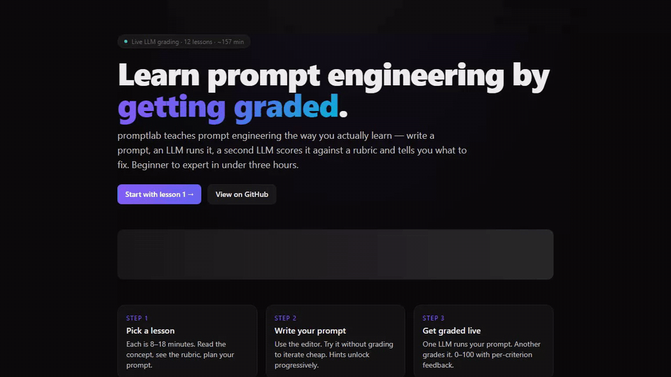
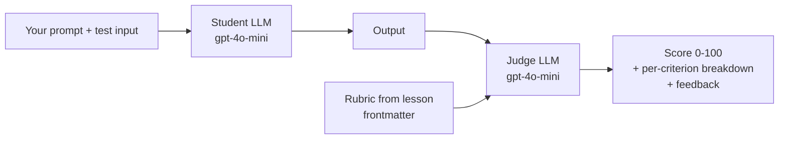

# promptlab

> *Learn prompt engineering by doing. Twelve lessons, beginner to expert, with assignments an LLM grades live.*
>
> **From Aravind Labs**



<p align="left">
  <a href="https://github.com/krish9219/promptlab/stargazers"></a>
  <a href="https://github.com/krish9219/promptlab/blob/main/LICENSE"></a>
  
  
  
</p>

Most prompt-engineering courses give you a list of techniques and call it a day. promptlab is the opposite: every lesson ends with an assignment where you write a prompt, an LLM runs it against a fixed test input, and a second LLM grades your output against a rubric — with per-criterion scores and written feedback. **You can't pass by reading; you have to write good prompts.**

```bash
git clone https://github.com/krish9219/promptlab
cd promptlab
cp .env.example .env       # add OPENAI_API_KEY
npm install
npm run dev
# open http://localhost:3004
```

## The curriculum

| # | Level | Lesson |
|---|---|---|
| 1 | Beginner | Anatomy of a prompt |
| 2 | Beginner | Specificity beats verbosity |
| 3 | Beginner | Roles, personas, and what doesn't help |
| 4 | Intermediate | Few-shot examples |
| 5 | Intermediate | Output format and JSON mode |
| 6 | Intermediate | Chain-of-thought reasoning |
| 7 | Advanced | Tool use and ReAct |
| 8 | Advanced | LLM-as-judge for evaluation |
| 9 | Advanced | Prompt injection defense |
| 10 | Expert | Self-consistency and ensembles |
| 11 | Expert | Iterative refinement chains |
| 12 | Expert | Production prompts (caching, eval, A/B) |

Each lesson takes 8–18 minutes. The whole curriculum is about 2.5 hours of focused practice.

## How the grader works



Two LLM calls per grade. The first runs your prompt against a fixed test input — same input every time, so you can iterate. The second compares the output to a rubric defined in the lesson's frontmatter (criteria + weights + descriptions) and produces a weighted score with written feedback.

The grader is opinionated. Length without substance loses points. Vague action items lose points. Missing schema fields lose points. The rubric is visible to you before you submit — there's no hidden test.

## Features

- **12 lessons** spanning beginner → expert, written as Markdown with frontmatter.
- **Live grading** — every assignment runs and grades in seconds, no waiting on a human.
- **Drafts auto-saved** to localStorage — your prompt persists across page reloads.
- **Best score remembered** per lesson.
- **"Try it" mode** — run your prompt without grading (no rubric pressure) to iterate cheaply.
- **Easy to extend** — add a lesson by dropping a `.md` file in `/lessons/` with valid frontmatter.

## Adding a lesson

Create `lessons/13-your-topic.md`:

```markdown
---
id: kebab-case-id
title: Human-readable title
level: 1     # 1=beginner, 2=intermediate, 3=advanced, 4=expert
index: 13    # ordering
estimatedMinutes: 10
assignment:
  task: What the student should accomplish
  testInput: |
    The input that will be fed to their prompt at grading time
rubric:
  - criterion: First thing to check
    weight: 3
    description: How to score it
  - criterion: Second thing
    weight: 2
    description: ...
---

# Lesson body in markdown

Write the lesson content here. Restart the dev server (or save and let Next.js HMR pick it up) and the lesson appears in the sidebar.
```

## Configuration

promptlab works with **any OpenAI-compatible endpoint** — OpenAI, OpenRouter, Groq, Together AI, DeepSeek, Mistral, Ollama, LM Studio, vLLM. Point `OPENAI_BASE_URL` at the provider's `/v1` endpoint.

| Env var | Default | Notes |
|---|---|---|
| `OPENAI_API_KEY` | required | Any non-empty string for local providers like Ollama |
| `OPENAI_BASE_URL` | `https://api.openai.com/v1` | Override to use any compatible provider |
| `MODEL_STUDENT` | `gpt-4o-mini` | Cheap model is fine — runs every prompt you submit |
| `MODEL_JUDGE` | `gpt-4o-mini` | Spend a bit more here; judging is harder than answering |
| `JUDGE_JSON_MODE` | `true` | Set to `false` for providers that don't support `response_format=json_object` |

### Provider examples

```bash
# OpenRouter — one key, hundreds of models
OPENAI_BASE_URL=https://openrouter.ai/api/v1
MODEL_STUDENT=anthropic/claude-haiku-4-5

# Groq — very fast inference
OPENAI_BASE_URL=https://api.groq.com/openai/v1
MODEL_STUDENT=llama-3.3-70b-versatile

# DeepSeek — cheap, capable
OPENAI_BASE_URL=https://api.deepseek.com/v1
MODEL_STUDENT=deepseek-chat

# Ollama — local, free
OPENAI_BASE_URL=http://localhost:11434/v1
OPENAI_API_KEY=ollama
MODEL_STUDENT=llama3.2
JUDGE_JSON_MODE=false

# vLLM / LM Studio / any OpenAI-compatible local server
OPENAI_BASE_URL=http://your-host:8000/v1
```

See [.env.example](.env.example) for the full list with example model IDs.

## Cost notes

Each `Try it` is one API call. Each `Grade my prompt` is two. With `gpt-4o-mini`, a full pass through all 12 lessons (one grade each) is roughly **$0.02 in API cost**.

## vs. the alternatives

| | promptlab | Learn Prompting | DeepLearning.AI courses | Books / blog posts |
|---|---|---|---|---|
| **Hands-on practice** | yes, graded | partial | yes (in notebooks) | no |
| **Self-hosted (your API key, no signup)** | yes | no | no | n/a |
| **Read-time + practice-time honest** | ~2.5 hr | varies | hours | varies |
| **Extendable curriculum** | yes (just add `.md`) | no | no | n/a |
| **Best for** | hands-on learners | reference reading | structured courses | depth on one topic |

## License

MIT — see [LICENSE](LICENSE).
